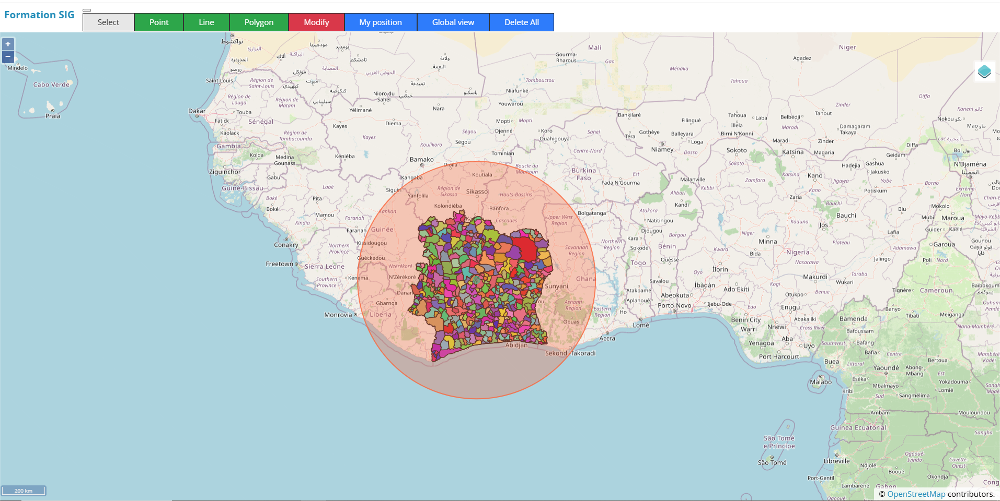
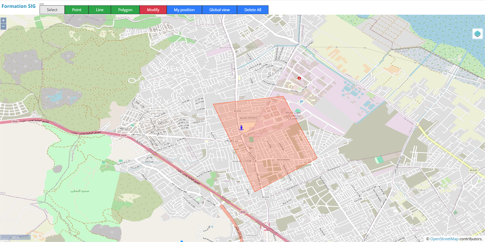
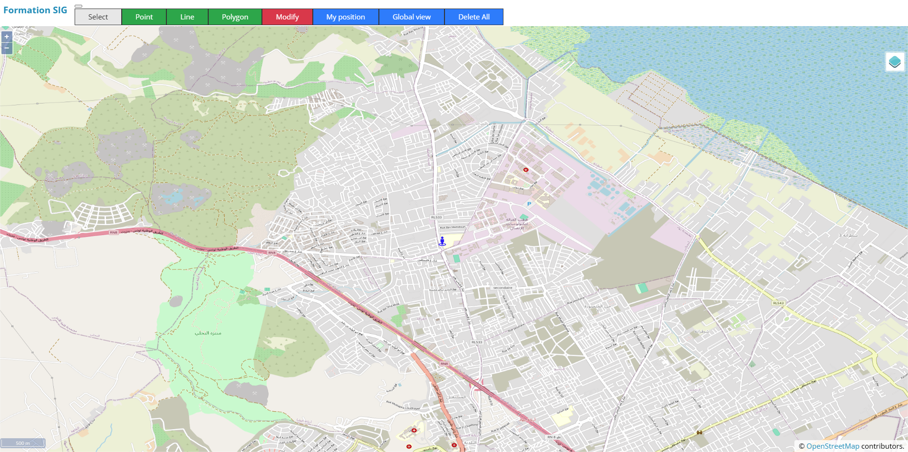

# 🌍 Web Mapping Project

Welcome to the **Web Mapping Project**! This guide will walk you through the process of creating, visualizing, and managing geospatial layers (also referred to as "couches") using **GeoServer**, **ArcMap**, **PostgreSQL**, and **OpenLayers**. The goal is to seamlessly integrate geospatial data into an interactive web client.

---

## 🛠 Prerequisites

Before starting, make sure you have the following tools installed:

- **Node.js** and **npm**: Required to run the server and manage project dependencies.
- **GeoServer**: A powerful tool for serving and managing geospatial data as Web Map Services (WMS).
- **ArcMap**: Used to visualize and prepare geospatial layers before uploading them to **GeoServer**.
- **PostgreSQL**: A relational database to store your geospatial data.
- **PostGIS**: A PostgreSQL extension that allows spatial queries and efficient management of geospatial data.

---

## 🌐 Setting Up GeoServer Layers

### 1. **Create Your Geospatial Layers:**
- Using **GeoServer**, create and manage your geospatial data layers. Ensure your data is georeferenced and formatted correctly.

### 2. **Publish Layers as WMS:**
- Once prepared, publish your layers as **Web Map Services (WMS)** for easy integration with **OpenLayers**.

### 3. **Verify Your WMS:**
- To ensure everything works as expected, test the WMS by previewing the layers directly in the **GeoServer** interface.

---

## 🎯 Visualizing Layers with OpenLayers

### 1. **Implement the Client-Side:**
- Use **JavaScript**, **CSS**, and **HTML** to create a web client that integrates with **OpenLayers**, enabling you to display your WMS layers from **GeoServer** on the map.

### 2. **Link WMS with OpenLayers:**
- Integrate the **WMS** endpoint with your OpenLayers map. Customize the map's functionality to allow for interactive viewing of your geospatial data.

---

## ⭐ Managing Data with PostgreSQL

### 1. **Setting Up PostgreSQL:**
- Install **PostgreSQL** and create a new database to store your geospatial data. The application will handle table creation automatically. Just make sure to configure your database credentials.

### 2. **Enable PostGIS for Spatial Data:**
- Install **PostGIS**, the PostgreSQL extension that enables spatial queries. This is necessary for efficient storage and querying of geospatial data.

---

## 🚀 Starting the Server

### 1. **Install Required Dependencies:**
- Navigate to the `server` directory within your project folder and install the required dependencies by running:
  ```bash
  npm install
  ```

### 2. **Launch the Server:**
- Once the dependencies are installed, start the server with the following command:
  ```bash
  node service.js
  ```

This will start the backend service that facilitates communication with **GeoServer** and **PostgreSQL**.

---

## 📸 Visuals from the Web App

### 1. **OpenLayers Map Displaying GeoServer Layers:**
   

### 2. **Shapes Displayed from the Database:**
   

### 3. **Displaying Local Position on the Map:**
   
